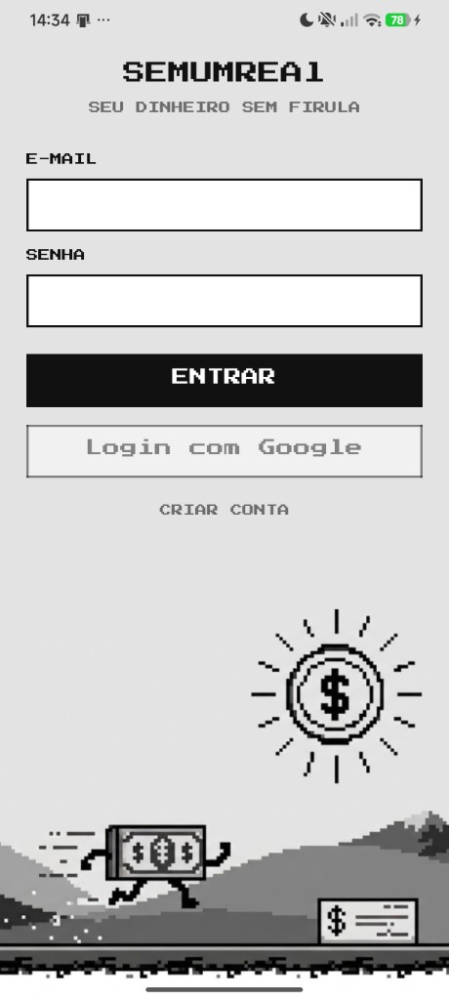
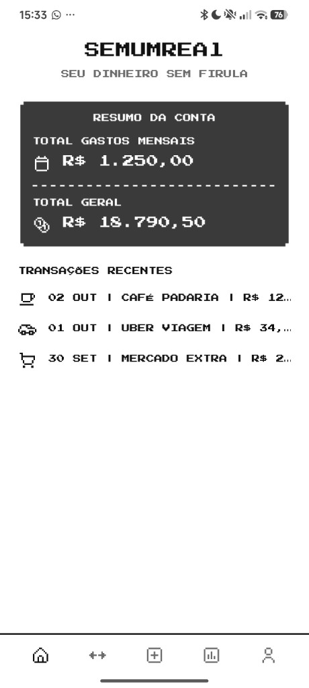

# SemUmReal Mobile

<p align="center">
  
  &nbsp;
  
</p>

App mobile do **SemUmReal**, sistema de controle financeiro. Cliente React Native (Expo) para o backend Spring Boot — visual pixel art, P&B, feito para uso no bolso.

> *Seu dinheiro sem firula.*

Este repositório é o app **Android / iOS** (Expo Go). Faz parte do mesmo produto que a [API](https://github.com/JoseMarcosEfi) (hexagonal / DDD) e o front web Angular.

Status atual: **login e cadastro contra a API** (JWT no dispositivo). A Home ainda usa dados mock. Projeto de estudo e portfólio.

## Screens

- **Login** — e-mail + senha, cadastro, botão Google (ainda inativo) e arte do futuro joguinho
- **Home** — resumo da conta (gastos do mês + total geral) e transações recentes
- **Perfil** — logout local (sem endpoint na API)
- **Tab bar** — Início e Perfil navegam; Transações, Novo e Relatórios ainda visuais

Dados de exemplo na Home: café, Uber, mercado — valores em BRL.

## Stack

| | |
|---|---|
| Runtime | [Expo SDK 54](https://docs.expo.dev/versions/v54.0.0/) |
| UI | React Native 0.81 + React 19 |
| Linguagem | TypeScript |
| Fonte | [Press Start 2P](https://fonts.google.com/specimen/Press+Start+2P) |
| Ícones | [Pixelarticons](https://pixelarticons.com/) + `react-native-svg` |
| Layout | `react-native-safe-area-context` |

Design tokens (`src/theme/tokens.ts`) espelham o `styles.scss` do Angular: mesma paleta, espaçamento em múltiplos de 8 e tamanhos de ícone 16 / 24 / 48.

## Estrutura

```
App.tsx                         # fonte + gate de sessão + telas
src/
├── api/                        # cliente HTTP + auth (login/register/me)
├── auth/                       # JWT (SecureStore) + Context
├── theme/                      # tokens (cor, espaço, fonte)
├── screens/
│   ├── auth/                   # login e cadastro
│   ├── home/
│   │   ├── HomeScreen.tsx
│   │   └── home-mock.ts        # dados fake (BRL)
│   └── profile/                # logout
└── components/
    ├── pixel-icon/             # ícones pixel (nativo + .web)
    └── tab-bar/                # barra inferior
```

## Como rodar

### Requisitos

- Node.js 20+
- npm
- [Expo Go](https://expo.dev/go) **SDK 54** no celular (Play Store / App Store)

### Instalação

```bash
git clone git@github.com:JoseMarcosEfi/SemUmReal-mobile.git
cd SemUmReal-mobile
npm install
npx expo start
```

No celular, abra o **Expo Go** e leia o QR (mesmo Wi-Fi do PC).  
Web: `npx expo start --web`.

Se o QR não conectar (firewall), libere a porta **8081 TCP** na rede particular, ou use USB:

```bash
adb reverse tcp:8081 tcp:8081
adb reverse tcp:8080 tcp:8080
```

Depois, no Expo Go: `exp://127.0.0.1:8081`.  
A API local (`./mvnw spring-boot:run -Dspring-boot.run.profiles=local`) precisa da **8080** encaminhada no USB.

## Próximos passos

- Navegação real nas tabs (React Navigation)
- Login com Google
- Trocar `home-mock.ts` por chamadas REST

## Autor

**José Marcos**

Projeto pessoal de aprendizado e demonstração de portfólio: app nativo alinhado ao mesmo produto e à API em arquitetura hexagonal.
